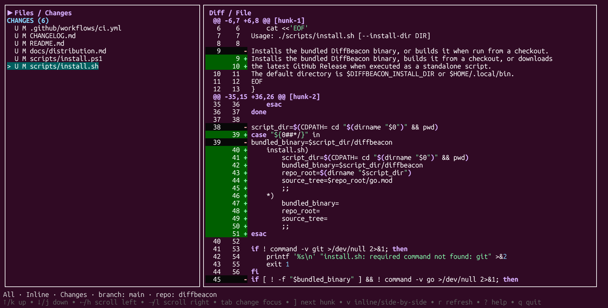

# DiffBeacon

[](https://github.com/andrespistoni/diffbeacon/actions/workflows/ci.yml?query=branch%3Amain)
[](https://github.com/andrespistoni/diffbeacon/releases/latest)
[](LICENSE)

DiffBeacon es una interfaz de terminal local y estrictamente read-only para
observar y revisar cambios de Git. Muestra cambios staged, modificaciones del
working tree y archivos nuevos sin editar el repositorio, ejecutar operaciones
remotas ni enviar contenido fuera de la máquina.



## Características

- Lista `STAGED` separada de `CHANGES`.
- Archivos tracked modificados y untracked integrados en `CHANGES`, con estado visible.
- El mismo path puede aparecer en `STAGED` y `CHANGES` cuando tiene cambios en ambos scopes.
- Diff inline o side-by-side.
- Vista changes-only o full-file, independientemente del layout.
- Navegación entre hunks.
- Syntax highlighting con fallback seguro a texto plano.
- Actualización automática ante cambios externos del working tree, índice y refs.
- Soporte explícito para archivos agregados, modificados, eliminados y renombrados.
- Resúmenes seguros para binarios, conflictos, submodules y contenido fuera de presupuesto.
- Sin stage, unstage, commit, checkout, discard, fetch, pull, push ni telemetría.

## Cómo funciona

DiffBeacon conserva scopes independientes para representar exactamente qué está
comparando Git:

| Entrada | Antes | Después |
|---|---|---|
| Staged | `HEAD` | índice |
| Change tracked | índice | working tree |
| Untracked | inexistente | archivo completo |

Los hunks tracked los calcula Git con Myers sobre snapshots raw temporales y
privados. DiffBeacon parsea ese patch para construir un único modelo utilizado
por las cuatro combinaciones de visualización:

| | Changes only | Full file |
|---|---|---|
| Inline | Sí | Sí |
| Side-by-side | Sí | Sí |

Los límites de changes-only y full-file son independientes. Un archivo demasiado
grande para renderizarse completo puede seguir mostrando un patch pequeño. La UI
explica cuándo full-file no está disponible y conserva changes-only.

## Inicio rápido

### Linux y macOS

Instalar la última release:

```sh
curl -fsSL https://raw.githubusercontent.com/andrespistoni/diffbeacon/main/scripts/install.sh | sh
export PATH="$HOME/.local/bin:$PATH"
```

Abrir el repositorio actual o indicar otro:

```sh
diffbeacon
diffbeacon /ruta/al/repositorio
```

Salir con `q` o `Ctrl+C`. Para desinstalar:

```sh
curl -fsSL https://raw.githubusercontent.com/andrespistoni/diffbeacon/main/scripts/uninstall.sh | sh
```

### Windows PowerShell

Instalar la última release:

```powershell
irm https://raw.githubusercontent.com/andrespistoni/diffbeacon/main/scripts/install.ps1 | iex
```

Abrir el repositorio actual o indicar otro:

```powershell
diffbeacon
diffbeacon C:\ruta\al\repositorio
```

Salir con `q` o `Ctrl+C`. Para desinstalar:

```powershell
irm https://raw.githubusercontent.com/andrespistoni/diffbeacon/main/scripts/uninstall.ps1 | iex
```

Los instaladores detectan la plataforma y arquitectura, descargan la última
GitHub Release y verifican su SHA-256 antes de instalar. DiffBeacon necesita Git
2.31.0 o posterior para ejecutarse.

## Requisitos

### Ejecución

- Git 2.31.0 o posterior disponible en `PATH`.
- Un directorio temporal escribible.
- Una terminal compatible con aplicaciones TUI.

Go no es necesario cuando se instala un paquete precompilado.

Si ya tenés la versión de Go indicada en `go.mod`, también podés instalar la
última versión desde el código fuente:

```sh
go install github.com/andrespistoni/diffbeacon/cmd/diffbeacon@latest
```

### Plataformas

| Plataforma | Arquitecturas | Estado |
|---|---|---|
| Linux | amd64, arm64 | Validada |
| macOS | Intel/amd64, Apple Silicon/arm64 | Build disponible; validar en host nativo |
| Windows | amd64, arm64 | Experimental |

Windows y macOS se distribuyen actualmente sin firma de código. SmartScreen o
Gatekeeper pueden mostrar advertencias al descargar los paquetes fuera de un
entorno de confianza.

## Instalación manual desde paquetes

Para instalar una distribución precompilada necesitás dos archivos:

```text
El paquete correspondiente a tu plataforma
SHA256SUMS
```

Descargalos desde [GitHub Releases](https://github.com/andrespistoni/diffbeacon/releases/latest).

La versión documentada a continuación es `0.1.2`.

### Elegir el paquete

| Sistema | Arquitectura reportada | Archivo |
|---|---|---|
| Linux | `x86_64` | `diffbeacon_0.1.2_linux_amd64.tar.gz` |
| Linux | `aarch64`/`arm64` | `diffbeacon_0.1.2_linux_arm64.tar.gz` |
| macOS | `x86_64` | `diffbeacon_0.1.2_darwin_amd64.tar.gz` |
| macOS | `arm64` | `diffbeacon_0.1.2_darwin_arm64.tar.gz` |
| Windows | `AMD64` | `diffbeacon_0.1.2_windows_amd64.zip` |
| Windows | `ARM64` | `diffbeacon_0.1.2_windows_arm64.zip` |

Linux/macOS pueden consultar su arquitectura con:

```sh
uname -m
```

Windows puede consultarla desde PowerShell con:

```powershell
$env:PROCESSOR_ARCHITECTURE
```

## Linux amd64

Ubicate en el directorio que contiene el paquete y `SHA256SUMS`:

```sh
cd "$HOME/Downloads"

PACKAGE=diffbeacon_0.1.2_linux_amd64.tar.gz
grep "  $PACKAGE\$" SHA256SUMS | sha256sum --check -

EXTRACT_DIR=diffbeacon-0.1.2-linux-amd64
mkdir "$EXTRACT_DIR"
tar -xzf "$PACKAGE" -C "$EXTRACT_DIR"
cd "$EXTRACT_DIR"

sh install.sh
diffbeacon --version
```

Para Linux arm64, reemplazá el nombre del paquete:

```sh
PACKAGE=diffbeacon_0.1.2_linux_arm64.tar.gz
EXTRACT_DIR=diffbeacon-0.1.2-linux-arm64
```

El instalador copia el binario a `~/.local/bin/diffbeacon`. Si ese directorio no
está en `PATH`, agregalo en la configuración de tu shell:

```sh
export PATH="$HOME/.local/bin:$PATH"
```

Para hacerlo persistente en Bash:

```sh
printf '\nexport PATH="$HOME/.local/bin:$PATH"\n' >> "$HOME/.bashrc"
```

Para Zsh:

```sh
printf '\nexport PATH="$HOME/.local/bin:$PATH"\n' >> "$HOME/.zshrc"
```

## macOS Intel

Ubicate en el directorio que contiene el paquete y `SHA256SUMS`:

```sh
cd "$HOME/Downloads"

PACKAGE=diffbeacon_0.1.2_darwin_amd64.tar.gz
grep "  $PACKAGE\$" SHA256SUMS | shasum -a 256 -c -

EXTRACT_DIR=diffbeacon-0.1.2-darwin-amd64
mkdir "$EXTRACT_DIR"
tar -xzf "$PACKAGE" -C "$EXTRACT_DIR"
cd "$EXTRACT_DIR"

sh install.sh
diffbeacon --version
```

## macOS Apple Silicon

Para Apple Silicon, usá el paquete arm64:

```sh
cd "$HOME/Downloads"

PACKAGE=diffbeacon_0.1.2_darwin_arm64.tar.gz
grep "  $PACKAGE\$" SHA256SUMS | shasum -a 256 -c -

EXTRACT_DIR=diffbeacon-0.1.2-darwin-arm64
mkdir "$EXTRACT_DIR"
tar -xzf "$PACKAGE" -C "$EXTRACT_DIR"
cd "$EXTRACT_DIR"

sh install.sh
diffbeacon --version
```

El destino predeterminado en macOS también es `~/.local/bin`. Las instrucciones
de `PATH` de la sección Linux se aplican igualmente a Bash o Zsh.

## Windows amd64

Abrí PowerShell en el directorio que contiene el ZIP y `SHA256SUMS`:

```powershell
Set-Location "$HOME\Downloads"

$Package = "diffbeacon_0.1.2_windows_amd64.zip"
$ChecksumLine = Get-Content .\SHA256SUMS |
    Where-Object { $_ -match "\s+$([regex]::Escape($Package))$" } |
    Select-Object -First 1

if ([string]::IsNullOrWhiteSpace($ChecksumLine)) {
    throw "No checksum found for $Package"
}

$Expected = ($ChecksumLine -split '\s+')[0].ToLowerInvariant()
$Actual = (Get-FileHash -LiteralPath $Package -Algorithm SHA256).Hash.ToLowerInvariant()

if ($Actual -ne $Expected) {
    throw "SHA256 mismatch for $Package"
}

$Destination = ".\diffbeacon-0.1.2"
if (Test-Path -LiteralPath $Destination) {
    throw "Destination already exists: $Destination"
}
Expand-Archive -LiteralPath $Package -DestinationPath $Destination
Get-ChildItem -LiteralPath $Destination | Unblock-File

& "$Destination\install.ps1"
diffbeacon --version
```

Para Windows arm64, cambiá únicamente:

```powershell
$Package = "diffbeacon_0.1.2_windows_arm64.zip"
```

El instalador usa `%LOCALAPPDATA%\DiffBeacon\bin`, lo agrega al `PATH` del usuario
y registra que esa entrada le pertenece. Es posible que necesites abrir una nueva
terminal para que otras aplicaciones reciban el `PATH` actualizado.

## Instalación personalizada

Linux/macOS:

```sh
sh install.sh --install-dir "$HOME/bin"
```

También puede establecerse:

```sh
DIFFBEACON_INSTALL_DIR="$HOME/bin" sh install.sh
```

Windows:

```powershell
& .\install.ps1 -InstallDir "$HOME\bin"
```

Para instalar en Windows sin modificar `PATH`:

```powershell
& .\install.ps1 -InstallDir "$HOME\bin" -NoPathUpdate
```

## Desinstalación

Si usaste la instalación rápida, ejecutá el comando remoto indicado en
[Inicio rápido](#inicio-rápido). También podés descargar e inspeccionar el
script antes de ejecutarlo.

Para una instalación manual, ejecutá el script incluido en el paquete extraído.

Linux/macOS:

```sh
sh uninstall.sh
```

Con un destino personalizado:

```sh
sh uninstall.sh --install-dir "$HOME/bin"
```

Windows:

```powershell
& .\uninstall.ps1
```

El desinstalador Windows elimina del `PATH` únicamente una entrada creada por el
instalador. Una ruta que ya existía antes de instalar DiffBeacon se conserva. Para
mantener expresamente una entrada administrada por el instalador:

```powershell
& .\uninstall.ps1 -KeepPath
```

## Ejecutar DiffBeacon

Desde cualquier directorio de un repositorio:

```sh
diffbeacon
```

También puede indicarse un repositorio, subdirectorio o archivo:

```sh
diffbeacon path/to/repository
diffbeacon path/to/repository/subdirectory
diffbeacon path/to/repository/file.go
```

Consultar la versión no requiere Git ni estar dentro de un repositorio:

```sh
diffbeacon --version
```

DiffBeacon valida Git antes de abrir la TUI. Repositorios bare, Git ausente o
incompatible y paths fuera de un repositorio producen un diagnóstico antes de
entrar en alternate screen.

## Controles

| Teclas | Acción |
|---|---|
| `j`/`↓`, `k`/`↑` | Mover selección o scroll según el foco |
| `h`/`←`, `l`/`→` | Scroll horizontal |
| `Tab` | Cambiar foco entre archivos y contenido |
| `Enter` | Abrir el contenido seleccionado |
| `Esc` | Volver a archivos o desactivar el hunk actual |
| `[` / `]` | Hunk anterior/siguiente |
| `v` | Alternar inline/side-by-side |
| `f` | Alternar changes-only/full-file |
| `1` | Mostrar todo |
| `2` | Filtrar staged |
| `3` | Filtrar changes, incluidos untracked |
| `4` | Filtrar sólo untracked |
| `r` | Refresh manual |
| `e` | Abrir/cerrar detalle del error |
| `?` | Alternar ayuda compacta/completa |
| `q` / `Ctrl+C` | Salir |

La barra inferior muestra filtro, layout, densidad, branch, repositorio, hunk,
refresh y errores. Los estados también tienen texto o símbolos: el color nunca es
el único medio para interpretar la UI.

## Contenido especial

| Tipo | Comportamiento |
|---|---|
| Untracked | Se muestra completo, con el lado anterior vacío |
| Deleted | Se conserva el contenido anterior, con el lado nuevo vacío |
| Binary | Se muestra metadata; los bytes no se imprimen como terminal text |
| Conflict | Vista informativa del working tree; no resuelve el conflicto |
| Submodule | Resumen de estado; no abre ni modifica su contenido interno |
| Type change | Metadata del cambio; hunks textuales deshabilitados |

Los controles ANSI, C0, DEL y C1 presentes en contenido o paths se muestran como
datos visibles y no se ejecutan en la terminal.

## Límites y archivos grandes

| Recurso | Límite predeterminado |
|---|---:|
| Full-file por lado | 1 MiB |
| Línea en full-file | 16 KiB |
| Líneas full-file combinadas | 20.000 |
| Input changes-only por lado | 64 MiB |
| Patch changes-only | 8 MiB |
| Línea del patch | 256 KiB |
| Líneas del patch | 100.000 |
| Highlighting | 256 KiB, 50.000 tokens, 250 ms |
| Status Git | 8 MiB, 100.000 entradas, 2 s |

Superar el presupuesto full-file no deshabilita automáticamente changes-only. Si
el patch sigue dentro de sus límites, la aplicación fuerza changes-only y explica
por qué full-file no está disponible. Otros excesos producen una vista degradada
explícita; nunca se presenta un recorte como si fuera un diff completo.

## Seguridad y privacidad

DiffBeacon está diseñado como observador local read-only:

- No modifica índice, working tree, refs, configuración ni metadata Git.
- No elimina `index.lock` ni otros locks.
- No ejecuta shell para construir comandos Git.
- Sólo permite formas exactas de consultas Git incluidas en una allowlist cerrada.
- Deshabilita hooks, fsmonitor, external diff, textconv, credenciales y transportes.
- No descarga blobs faltantes de partial clones.
- No ejecuta filtros `process` configurados por el repositorio.
- No contiene telemetría ni cliente de red.
- No envía código, paths, diffs, métricas ni identidad a servicios externos.

Git y fsnotify se utilizan como fuentes locales. fsnotify solicita refreshes; Git
continúa siendo la fuente de verdad y una reconciliación periódica recupera eventos
perdidos.

## Compilar desde código fuente

Requisitos de desarrollo:

- Go 1.26.
- Git 2.31.0 o posterior.
- `make` para los comandos canónicos.
- `tar` y `zip` para generar paquetes de distribución.

Build local:

```sh
make build
./bin/diffbeacon --version
./bin/diffbeacon
```

Instalar compilando el checkout:

```sh
make install
```

Pruebas principales:

```sh
make test
make vet
make test-race
make test-e2e
```

Verificación completa de release:

```sh
make release-check VERSION=0.1.2
```

## Generar paquetes para compartir

Para una prueba local de empaquetado, pasá una versión SemVer sin prefijo `v`:

```sh
make dist VERSION=0.1.2
```

Los paquetes finales quedan en `dist/`; los seis binarios raw quedan en
`build/release/`. `make dist` recompila todas las plataformas, crea los archives,
genera SBOM/procedencia local y verifica `dist/SHA256SUMS`.

En una publicación oficial no se mantiene un archivo de versión: el tag
`vMAJOR.MINOR.PATCH` es la única fuente de verdad. El workflow de release
extrae la versión del tag, valida que exista en `CHANGELOG.md` y la inyecta en
los binarios, nombres de paquetes, SBOM y procedencia.

No publiques contenido diferente reutilizando la misma versión. Dos artefactos
con el mismo nombre y hashes distintos vuelven ambiguas las instalaciones y
actualizaciones.

Para compartir una plataforma alcanza con enviar:

```text
diffbeacon_VERSION_PLATFORM_ARCH.tar.gz (o .zip)
SHA256SUMS
```

No agregues `dist/` al historial Git. Las releases oficiales se publican
automáticamente al enviar el tag.

## Alcance de v0.1

DiffBeacon no intenta reemplazar una interfaz Git completa. Esta versión no:

- Hace stage o unstage.
- Crea commits.
- Modifica o descarta archivos.
- Resuelve conflictos.
- Ejecuta fetch, pull, push, merge, rebase o cherry-pick.
- Revisa pull requests o atribuye cambios a personas/agentes.

Los hunks son exclusivamente unidades de visualización y navegación.

## Documentación

- [Uso detallado](docs/usage.md)
- [Distribución manual](docs/distribution.md)
- [Compatibilidad](docs/compatibility.md)
- [Arquitectura](docs/architecture.md)
- [Rendimiento y límites](docs/performance.md)
- [Política de dependencias](docs/dependency-policy.md)
- [Checklist de release](docs/release-checklist.md)

## Licencia

DiffBeacon se distribuye bajo la [licencia MIT](LICENSE).

Copyright (c) 2026 Andrés Pistoni.
